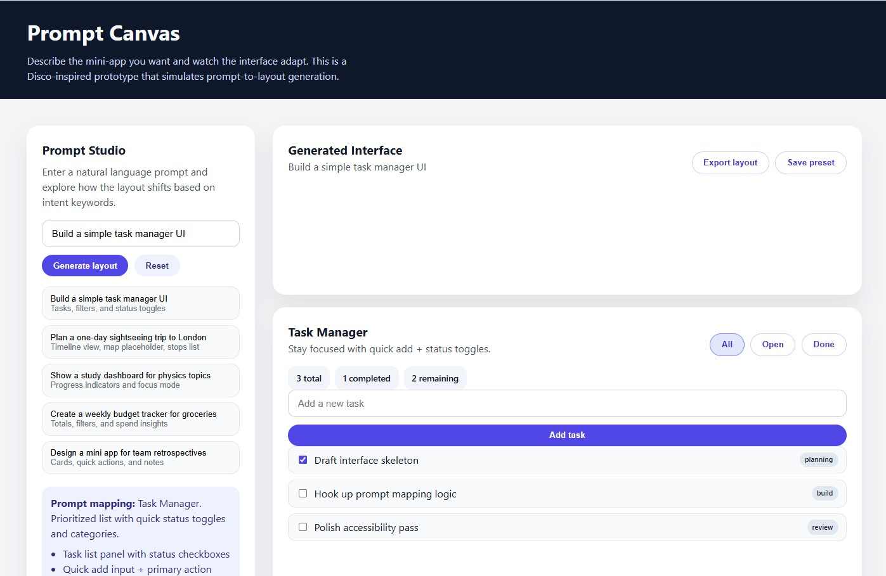

# Prompt Canvas (Disco-Style UI Replica)

Prompt Canvas is a front-end prototype that simulates prompt-to-layout UI
generation. It uses keyword-driven logic to render a dynamic interface inspired
by the Google Disco / GenTabs concept.

## Live Demo
- https://superq-prompt-canvas.vercel.app

## Screenshots


## Features
- Prompt-driven layout switching with visible mapping rationale.
- Modular templates: task manager, trip planner, study dashboard, budget tracker.
- Interactive UI elements (add, toggle, filters, focus mode).
- Responsive layout (desktop + mobile) with accessible controls.

## Getting Started
```bash
npm install
npm run dev
```

## Build
```bash
npm run build
npm run preview
```

## Prompt Examples
- “Build a simple task manager UI”
- “Plan a one-day sightseeing trip to London”
- “Show a study dashboard for physics topics”
- “Create a weekly budget tracker for groceries”

## Component & Design Rationale
- `App` orchestrates prompt input and template rendering.
- `utils/promptMapper.ts` performs prompt → template matching.
- Template components (`TaskManager`, `TripPlanner`, `StudyDashboard`,
  `BudgetTracker`, `GenericCanvas`) handle domain-specific UI behaviors.
- Shared styling ensures consistent card and grid behavior across templates.

## Documentation
- UX notes: `docs/ux-doc.md`
- Slide deck outline: `docs/slide-deck.md`

## Accessibility Notes
- Semantic headings and form labels.
- `aria-live` status updates for prompt mapping.
- Keyboard-friendly buttons and focus states.

