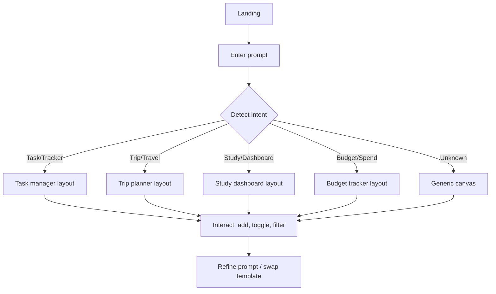

# Prompt Canvas UX Notes

## Goal
Create a Disco-inspired, prompt-to-layout experience that adapts a UI shell to
the user's intent without requiring real AI generation.

## User Flow (Mermaid)

## Prompt → UI Mapping Rationale
- Simple keyword matching keeps the experience transparent and deterministic.
- The system surfaces the mapping in a "Prompt mapping" panel to build user
  trust and explain why a layout appears.
- When there is no strong match, the UI defaults to a flexible "Quick Canvas"
  layout that still demonstrates layout generation.

## Component Hierarchy
- `App`
  - Prompt Studio
    - Prompt input
    - Suggestions
    - Prompt mapping insights
  - Generated Interface
    - Template switcher
      - `TaskManager`
      - `TripPlanner`
      - `StudyDashboard`
      - `BudgetTracker`
      - `GenericCanvas`

## Responsive Layout Strategy
- Two-column layout for desktop: prompt panel + generated canvas.
- Single-column layout below 900px width to keep reading order consistent.
- Cards and lists use CSS grid with auto-fit to adapt to width.

## Accessibility Notes
- Semantic headings and labels for all inputs.
- `aria-live` on prompt mapping feedback for screen readers.
- Focus states and keyboard-friendly controls (buttons, inputs).
- High-contrast button styles and spacing to reduce cognitive load.

## Interaction Patterns
- Task list supports add and toggle actions.
- Trip planner supports view switch (timeline/cards) and add stop.
- Study dashboard supports focus mode and quick progress boosts.
- Budget tracker supports category filters and total recalculation.

